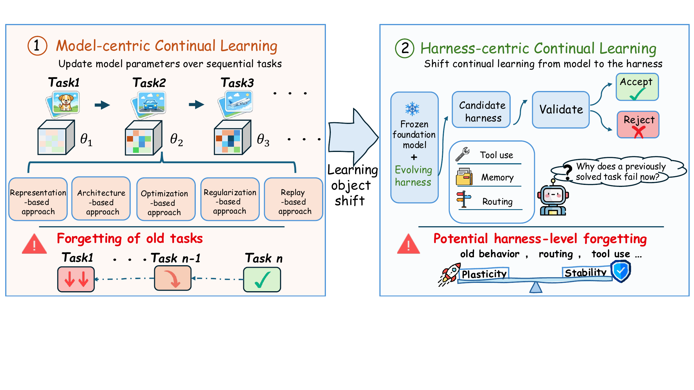
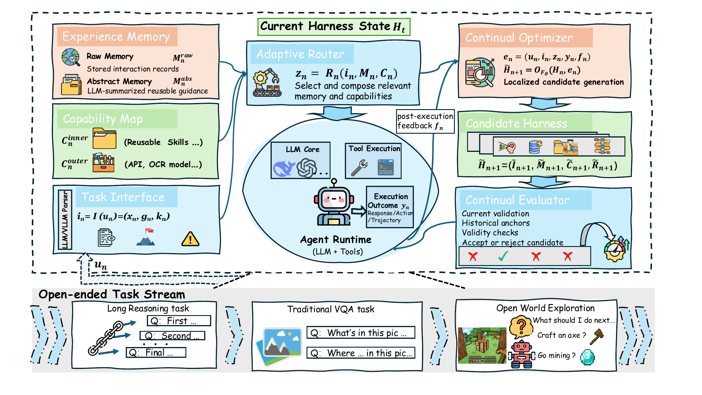
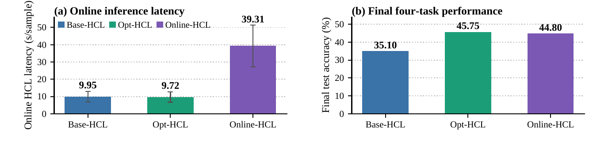

<h1 align="center">Harness Continual Learning</h1>

<p align="center"><strong>Continual Adaptation Beyond Model Parameters</strong></p>

Official implementation of **Harness Continual Learning (HCL)**, a framework that enables frozen foundation-model agents to continually adapt their memory, routing, task interfaces, reusable capabilities, and optimization policies.

<p align="center">
  
</p>

## Abstract

Continual learning has largely focused on model parameters, yet modern agents can also adapt through a harness of prompts, memories, tools, skills, and routing rules. We introduce **Harness Continual Learning (HCL)**, a paradigm in which this harness evolves around a frozen foundation model, and define the resulting loss of previously acquired behavior as **harness-level forgetting**. HCL comprises four execution-facing components: the Task Interface, Experience Memory, Capability Map, and Adaptive Router. To balance adaptation and retention, **guarded harness evolution** separates update generation from state commitment: a Continual Optimizer proposes candidate harnesses from execution feedback, while a Continual Evaluator commits an update only after checking current improvement, historical retention, and validity. Across open-world capability accumulation, textual reasoning, and multimodal perception, HCL supports capability growth and failure recovery, exceeds corresponding baselines by more than 10% in multiple settings, and provides a controllable stability–plasticity trade-off.

## Key contributions

We evaluate HCL across textual reasoning, multimodal perception, and open-world interaction, and further study retention control, harness-level distillation, and component contributions. Our main contributions are:

- **Harness Continual Learning:** We propose and formalize HCL as a new continual learning paradigm, shifting the object of continual learning from model state to the harness state surrounding a frozen foundation model.
- **Guarded harness evolution:** We identify harness-level forgetting and make current improvement, historical retention, and validity explicit conditions for committing a harness update.
- **Capability accumulation and controlled retention:** Across reasoning, multimodal, and interactive task streams, we show that harness evolution supports capability accumulation. Component ablations and retention sweeps reveal the contributions of individual harness components, measurable forgetting, and controllable stability–plasticity trade-offs, with exploratory evidence of knowledge transfer.

<p align="center">
  
</p>

## Repository layout

```text
HCL/
├── hcl/                         # Core HCL implementation
│   ├── capability/              # Reusable skills, tools, and capability services
│   ├── memory/                  # Raw, abstract, and anchor memories
│   ├── optimizer/               # Candidate harness-update generation
│   ├── router/                  # Workflow and artifact selection prompts
│   └── task_interface/          # Shared task structuring interface
├── configs/                     # Paper experiment and task-stream profiles
├── data/                        # Expected external dataset layout
├── examples/                    # Minimal synthetic task-stream fixtures
├── tests/                       # Offline unit and regression tests
├── scripts/                     # Utility and integration scripts
├── experiments/
│   ├── HCL_ALFworld/            # ALFWorld integration
│   └── Odyssey/                 # Minecraft/Odyssey integration
├── docs/assets/                 # README figures
├── main.py                      # Main experiment entry point
├── run.sh                       # Reference launch script
├── requirements.txt
└── pyproject.toml
```

The core implementation is exposed at the repository root, following the same entry-point-oriented layout as DFA-MoE. ALFWorld and Odyssey retain isolated environments because their simulator dependencies are incompatible with parts of the core stack.

## Installation

### Core environment

Python 3.10 or later is required.

```bash
git clone https://github.com/RL-MIND/Harness-Continual-Learning.git
cd HCL
python3 -m venv .venv
source .venv/bin/activate
python -m pip install --upgrade pip
python -m pip install -r requirements.txt
```

Install optional dependencies only when needed:

```bash
# Local Transformers models
python -m pip install -e '.[local-model]'

# COCO metrics and development tests
python -m pip install -e '.[coco-eval,test]'
```

Verify the installation without model or dataset downloads:

```bash
python -m unittest discover -s tests -v
```

## Supported task streams

| Modality | Task stream | Tasks |
| --- | --- | --- |
| Textual reasoning | `configs/taskstream_textual_main_250_50_500.json` | MuSiQue, ProofWriter, GSM8K, HotpotQA |
| Multimodal | `configs/taskstream_multimodal_main_250_50_500.json` | COCO detection, COCO captioning, RefCOCO grounding, VQAv2 |
| Embodied | `experiments/HCL_ALFworld/` | ALFWorld domain-incremental sequences |
| Open world | `experiments/Odyssey/` | Minecraft/Odyssey curriculum tasks |

Datasets and model checkpoints are not redistributed. Prepare them under `data/` according to [the data layout](data/README.md), or update the project-relative paths in the selected task-stream file.

## Quick start

### Run a textual HCL experiment

The following profile runs Stability-HCL with a Qwen3-4B main model:

```bash
python main.py \
  --config configs/run_stability_hcl_01_4b.json \
  --splits train,test
```

The equivalent installed command is:

```bash
hcl run \
  --config configs/run_stability_hcl_01_4b.json \
  --splits train,test
```

Use `--limit-per-task` for a small integration run, and use `--method` to override the method declared by a profile:

```bash
python main.py \
  --config configs/deepseek_flash_reasoning_hcl_stability_250_50_500.json \
  --splits train,test \
  --limit-per-task 5 \
  --method hcl
```

`run.sh` is a reference wrapper around the same entry point. Its first argument may be a configuration path; remaining arguments are forwarded to `main.py`.

### Run the baselines

Use the checked-in baseline profiles directly:

```bash
# Zero-shot
python main.py --config configs/deepseek_flash_reasoning_raw_zero_shot_500.json --splits test
```

See [the configuration inventory](configs/README.md) for the complete reasoning, multimodal, budget-sweep, and distillation profile list.

## Important configuration options

HCL experiments use JSON configurations. The main options are:

```json
{
  "method": "hcl",
  "task_stream_path": "configs/taskstream_textual_main_250_50_500.json",
  "storage_dir": "storage/experiments/example",
  "model": {
    "backend": "chat_completions",
    "name": "model-name",
    "base_url": "http://127.0.0.1:8000",
    "api_key_env": "MODEL_API_KEY"
  },
  "optimizer": {
    "historical_loss_budget": 0
  }
}
```

- `model` generates final answers. `judge_model`, `selection_model`, and `memory_model` can assign optimizer, online-selection, and memory operations to different models.
- `method` selects the HCL update mode. Supported CLI overrides are `hcl` and `hcl_memory`.
- `optimizer.historical_loss_budget` controls accepted historical degradation; `null` represents $b=\infty$.
- `storage_dir` contains generated state, metrics, predictions, and checkpoints and must remain under `storage/` when automatic reset is enabled.
- `task_flow` controls the named train/test phases selected with `--splits`.

For hosted OpenAI-compatible endpoints, export the credential named by `api_key_env`; do not place secrets in configuration files:

```bash
export MODEL_API_KEY="your-key"
```

## Experiments

### ALFWorld

```bash
cd experiments/HCL_ALFworld
python3 -m venv .venv
source .venv/bin/activate
python -m pip install -e '.[llm]'
hcl-alfworld --help
```

Use the `local` extra for a local Transformers backend. Profiles are in `configs/`, and domain-incremental sequences are in `sequences/`.

### Odyssey / Minecraft

```bash
cd experiments/Odyssey/Odyssey
python3 -m venv .venv
source .venv/bin/activate
python -m pip install -e .
cp conf/config.example.json conf/config.json
python harness_cli.py --help
python harness_curriculum_cli.py --help
```

Odyssey additionally requires its Node/Mineflayer bridge, a reachable Minecraft server, and an OpenAI-compatible model endpoint. Local values can be supplied with `ODYSSEY_*` environment variables; `conf/config.json` is ignored by version control.

## Main results

The results below follow the order of the experiments in the main paper. Additional analyses reported only in the appendix are not included here.

### Open-world capability accumulation

#### ALFWorld

We evaluate six sequential ALFWorld task categories with a frozen Qwen3.5-9B model. Plasticity-HCL achieves the highest final average success rate, while Stability-HCL retains comparable performance with substantially less forgetting.

| Method | Pick | Look | Clean | Heat | Cool | Two-object | Final Avg. $\uparrow$ | Avg. Fgt. (%) $\downarrow$ |
| --- | ---: | ---: | ---: | ---: | ---: | ---: | ---: | ---: |
| Static Harness | 95.80 | 66.70 | 25.80 | 26.10 | 9.50 | 58.80 | 47.12 | — |
| RAG Baseline | 95.80 | 83.30 | 41.90 | 39.10 | 14.30 | 58.80 | 55.56 | **1.74** |
| **Stability-HCL (Ours)** | **100.00** | 83.30 | **51.60** | 30.40 | 28.60 | 76.50 | 61.74 | 2.64 |
| **Plasticity-HCL (Ours)** | **100.00** | 77.80 | 41.90 | 39.10 | 19.00 | **100.00** | **62.98** | 10.94 |

#### Minecraft

On a 50-task Minecraft curriculum, Plasticity-HCL completes the full sequence in 83 environment actions.

### Controlled-stream continual learning

We next evaluate HCL on textual reasoning and multimodal perception streams. Each task contains 250 adaptation examples, 50 validation examples, and 500 disjoint test examples.

#### Textual reasoning

The stream order is MuSiQue $\rightarrow$ ProofWriter $\rightarrow$ GSM8K $\rightarrow$ HotpotQA, using frozen DeepSeek-V4.1-Flash. Plasticity-HCL obtains the best final average performance of 76.10%.

| Method | MuSiQue | ProofWriter | GSM8K | HotpotQA | Final Avg. $\uparrow$ | Avg. Fgt. (%) $\downarrow$ |
| --- | ---: | ---: | ---: | ---: | ---: | ---: |
| Zero-shot | 48.00 | 79.20 | 65.20 | 62.20 | 63.65 | — |
| **Plasticity-HCL (Ours)** | **58.60** | **85.60** | **96.00** | **64.20** | **76.10** | 0.40 |
| **Stability-HCL (Ours)** | 53.60 | 82.80 | 82.60 | 63.60 | 70.65 | 0.27 |

#### Multimodal perception

The stream order is COCO detection $\rightarrow$ COCO captioning $\rightarrow$ RefCOCO grounding $\rightarrow$ VQAv2, using frozen Qwen3.6-27B. Stability-HCL achieves the best final mean of 68.92 with only 0.22% average forgetting.

| Method | Detection | Caption | Grounding | VQAv2 | Final Mean $\uparrow$ | Avg. Fgt. (%) $\downarrow$ |
| --- | ---: | ---: | ---: | ---: | ---: | ---: |
| Zero-shot | 37.52 | 21.10 | 43.00 | **85.47** | 46.77 | — |
| **Plasticity-HCL (Ours)** | 64.14 | 37.31 | 90.60 | 79.80 | 67.96 | 0.81 |
| **Stability-HCL (Ours)** | **65.34** | **39.41** | **91.60** | 79.33 | **68.92** | 0.22 |

### Stability–plasticity control

We vary the historical-loss budget over $b\in\{0,1,3,\infty\}$ while holding the current-improvement and validity criteria fixed. The strict setting $b=0$ minimizes forgetting, whereas a small tolerance of $b=1$ produces the best final average accuracy. Further relaxation degrades both final accuracy and retention.

| Historical-loss budget $b$ | MuSiQue | ProofWriter | GSM8K | HotpotQA | Final Avg. $\uparrow$ | Avg. Fgt. (%) $\downarrow$ |
| ---: | ---: | ---: | ---: | ---: | ---: | ---: |
| $0$ | 27.83 | 73.33 | 84.33 | **59.50** | 61.25 | **0.39** |
| $1$ | 24.83 | 77.50 | **92.33** | 59.17 | **63.46** | 1.22 |
| $3$ | 26.83 | **79.83** | 83.00 | 58.50 | 62.04 | 2.00 |
| $\infty$ | **28.33** | 71.00 | 82.00 | 59.17 | 60.13 | 3.45 |

### External-model assistance

Base-HCL uses Qwen3-4B throughout. Opt-HCL uses Qwen3.6-27B only to generate candidate harness updates, whereas Online-HCL uses the stronger model for per-example online harness operations. Opt-HCL improves final average accuracy from 35.10% to 45.75% while maintaining latency comparable to Base-HCL; Online-HCL reaches 44.80% but incurs substantially higher online latency.

<p align="center">
  
</p>

### Component ablation

On the controlled multimodal stream with frozen Qwen3.5-4B, each ablation keeps one component available during execution but freezes its persistent updates. All four components contribute to continual adaptation, with freezing Experience Memory causing the largest reduction in final average performance and the most forgetting.

| Variant | Interface | Memory | Capability | Router | Final Avg. $\uparrow$ | Avg. Fgt. (%) $\downarrow$ |
| --- | :---: | :---: | :---: | :---: | ---: | ---: |
| Zero-shot | — | — | — | — | 34.84 | — |
| w/o Interface update | ✗ | ✓ | ✓ | ✓ | 62.37 | 0.11 |
| w/o Memory update | ✓ | ✗ | ✓ | ✓ | 62.28 | 0.83 |
| w/o Capability update | ✓ | ✓ | ✗ | ✓ | 63.12 | **0.06** |
| w/o Router update | ✓ | ✓ | ✓ | ✗ | 62.77 | 0.14 |
| **Plasticity-HCL** | ✓ | ✓ | ✓ | ✓ | **63.41** | 0.45 |

## Notes

- `main.py`, the installed `hcl` command, and `run.sh` are the recommended core entry points.
- Generated logs, predictions, checkpoints, caches, simulator state, and credentials are intentionally excluded.
- Some configuration filenames retain original GPU scheduling labels; the configurations themselves use portable paths and do not require that device index.
- The ALFWorld and Odyssey environments should be installed separately from the core environment.

## Citation

If you find this repository useful, please cite the HCL paper:

```bibtex
@misc{kang2026harnesscontinuallearning,
  title         = {Harness Continual Learning: Continual Adaptation Beyond Model Parameters},
  author        = {Borui Kang and Jinrui Gu and Junhan Lv and Wenbin Li and Lei Wang and Yang Gao},
  year          = {2026},
  eprint        = {2608.19013},
  archivePrefix = {arXiv},
  primaryClass  = {cs.LG},
  url           = {https://arxiv.org/abs/2608.19013}
}
```

## License and acknowledgements

The core HCL implementation is released under the [MIT License](LICENSE). The integrations under `experiments/` build on ALFWorld, Odyssey, Mineflayer, and related third-party components; consult their respective licenses before redistribution.
